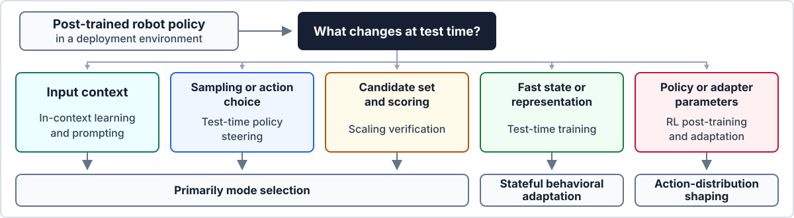

# 🤖 Awesome Test-Time Robot Learning

[](https://awesome.re)
[](LICENSE)

A curated research map of how robot policies improve after pre-training and task-level post-training, using context, test-time computation, deployment experience, or online interaction.

## 🎯 Scope

We use **test-time robot learning** as a broad deployment-stage umbrella: a post-trained robot policy encounters a concrete environment and improves within an inference call, an episode, or a sequence of online interactions. The list is centered on manipulation, while including general robot-learning methods when their test-time mechanism transfers directly.

A paper belongs here when it changes deployment context; action sampling, guidance, or selection; candidate generation and verification; a fast state, memory, or representation; or policy-side parameters using deployment data. Routine pre-training, ordinary task fine-tuning with a fixed offline dataset, and planning without a learned robot policy are outside the main scope.

## 🗺️ Research Map



The five lines are organized by their primary deployment-time mechanism and supervision source. Hybrid methods are expected; each paper is assigned to the line that best captures its central contribution.

<details>
<summary><strong>Compare the five lines</strong></summary>

| Line | Core mechanism | Deployment signal | Expected effect | Main limitation |
| --- | --- | --- | --- | --- |
| RL Post-Training | RL optimization after task-level post-training | Rewards, success labels, interventions, online rollouts | Produces an RL-improved policy, adapter, residual controller, or latent interface | Interaction cost, resets, safety, and reward design |
| Test-Time Policy Steering | Guides sampling, denoising, flow, or action selection at execution | Value functions, VLM rewards, dynamics, constraints | Improves action generation or selection for the current setting | Candidate coverage, guidance quality, and inference latency |
| Test-Time Adaptation and Training (TTA & TTT) | Adapts restricted parameters, state, or representations from deployment data | Self-supervised losses, feedback, predictive objectives, trajectory history | Responds to distribution shift, temporal context, or model mismatch | Objective alignment, stability, and forgetting |
| In-Context Learning and Prompting | Conditions a policy on demonstrations, video, language, or sensorimotor context | Prompt examples supplied at deployment | Uses demonstrations and instructions without a gradient update | Requires a policy trained to interpret the prompt modality |
| Scaling Verification | Samples broadly and verifies candidate actions or instructions | Alignment, value, consistency, or success scores | Recovers better behavior through candidate generation and selection | Correct behavior must be sampled; the verifier must be reliable |

</details>

## 📚 Contents

- [🧪 RL Post-Training](#1-rl-post-training)
- [🧭 Test-Time Policy Steering](#2-test-time-policy-steering)
- [🧠 Test-Time Adaptation and Training (TTA & TTT)](#3-test-time-adaptation-and-training)
- [🎬 In-Context Learning and Prompting](#4-in-context-learning-and-prompting)
- [✅ Scaling Verification](#5-scaling-verification)
- [🤝 Contributing](#contributing)

Papers are sorted by their first public release date, from oldest to newest. Venue denotes the latest known publication venue; otherwise it is listed as `arXiv`.

<!-- GENERATED_PAPER_LISTS_START -->
<a id="1-rl-post-training"></a>
## 1. 🧪 RL Post-Training

These methods use reinforcement learning after task-level post-training to improve a policy, adapter, residual controller, or latent interface from reward-bearing interaction.

**Typical mechanism:** Policy-wide or restricted parameter optimization, residual control, latent-space optimization, or online actor-critic updates.

**Core advantage:** Can improve state-action associations using rewards and interaction beyond behavior cloning.

**Main limitation:** Interaction cost, resets, safety, reward design, and stability of online optimization.

**Papers (14)**

| Date | Paper | Venue | Resources | Tags |
| --- | --- | --- | --- | --- |
| 2024-07-23 | [From Imitation to Refinement: Residual RL for Precise Assembly](https://arxiv.org/abs/2407.16677) | `ICRA 2025` | [Project](https://residual-assembly.github.io/) | Residual RL, Assembly, PPO, Sim-to-Real |
| 2024-09-01 | [Diffusion Policy Policy Optimization (DPPO)](https://arxiv.org/abs/2409.00588) | `ICLR 2025` | - | Diffusion Policy, On-Policy RL, PPO |
| 2024-12-18 | [Policy Decorator: Model-Agnostic Online Refinement for Large Policy Model](https://arxiv.org/abs/2412.13630) | `ICLR 2025` | [Project](https://policydecorator.github.io/) | Residual RL, Online Adaptation, SAC, Model-Agnostic |
| 2025-05-24 | [VLA-RL: Towards Masterful and General Robotic Manipulation with Scalable Reinforcement Learning](https://arxiv.org/abs/2505.18719) | `arXiv` | - | VLA, Online RL, PPO, Process Reward |
| 2025-08-20 | [HIL-SERL: Precise and Dexterous Robotic Manipulation via Human-in-the-Loop Reinforcement Learning](https://doi.org/10.1126/scirobotics.ads5033) | `Science Robotics` | - | Human-in-the-Loop RL, Real-World RL, Human Intervention |
| 2025-09-18 | [Unified Latent Steering and Residual Refinement for Online Improvement of Diffusion Policy Models](https://openreview.net/forum?id=9sQVoVMeSD) | `ICML 2026 Workshop / CoRL 2026 Submission` | - | Diffusion Policy, Latent Steering, Residual RL, Online RL |
| 2025-09-23 | [Residual Off-Policy RL for Finetuning Behavior Cloning Policies](https://arxiv.org/abs/2509.19301) | `ICLR 2026 Workshop` | - | Residual RL, Off-Policy RL, Behavior Cloning |
| 2025-10-16 | [RL-100: Performant Robotic Manipulation with Real-World Reinforcement Learning](https://arxiv.org/abs/2510.14830) | `Science Robotics` | [Project](https://lei-kun.github.io/RL-100/) | Real-World RL, Offline-to-Online RL, Diffusion Policy |
| 2026-01-11 | [On-the-Fly VLA Adaptation via Test-Time Reinforcement Learning](https://arxiv.org/abs/2601.06748) | `arXiv` | - | VLA, Test-Time RL, LoRA, Online Adaptation |
| 2026-02-13 | [Beyond Imitation: Reinforcement Learning-Based Sim-Real Co-Training for VLA Models](https://arxiv.org/abs/2602.12628) | `ICRA 2026 Workshop` | - | VLA, Sim-to-Real, Co-Training, RL Fine-Tuning |
| 2026-05-12 | [TMRL: Diffusion Timestep-Modulated Pretraining Enables Exploration for Efficient Policy Finetuning](https://arxiv.org/abs/2605.12236) | `arXiv` | - | Diffusion Policy, Exploration, RL Fine-Tuning, Action Coverage |
| 2026-05-19 | [Beyond Action Residuals: Real-World Robot Policy Steering via Bottleneck Latent Reinforcement Learning](https://arxiv.org/abs/2605.19919) | `arXiv` | [Project](https://manutdmoon.github.io/ZPRL/) | Latent-Space RL, Flow Matching, Real-World RL, Policy Adaptation |
| 2026-06-30 | [Adapting Generalist Robot Policies with Semantic Reinforcement Learning](https://arxiv.org/abs/2606.31958) | `arXiv` | - | VLA, Semantic Actions, Real-World RL, Online Adaptation |
| 2026-07-09 | [FlowDAgger: Human-in-the-Loop Adaptation of Generative Robot Policies in Latent Space](https://arxiv.org/abs/2607.08877) | `arXiv` | - | Human-in-the-Loop, DAgger, Generative Policy, Action Inversion |

<a id="2-test-time-policy-steering"></a>
## 2. 🧭 Test-Time Policy Steering

These methods keep the base policy frozen and intervene in its action-generation process by re-ranking candidates, guiding denoising or flow trajectories, optimizing noise, or applying external value and constraint signals.

**Typical mechanism:** The sampling process, candidate action, noise variable, denoising or flow trajectory, or execution-time controller around a frozen policy.

**Core advantage:** It is modular and often data-light, making it attractive when the desired behavior already exists in the policy distribution.

**Main limitation:** It usually cannot repair missing support; guidance quality, repeated sampling, and external models can also add substantial latency.

**Papers (8)**

| Date | Paper | Venue | Resources | Tags |
| --- | --- | --- | --- | --- |
| 2024-10-18 | [Steering Your Generalists: Improving Robotic Foundation Models via Value Guidance](https://arxiv.org/abs/2410.13816) | `CoRL 2024` | - | Value Guidance, Action Re-Ranking, Offline RL, Black-Box Steering |
| 2025-06-16 | [DynaGuide: Steering Diffusion Policies with Active Dynamic Guidance](https://arxiv.org/abs/2506.13922) | `NeurIPS 2025` | - | Diffusion Guidance, Latent Dynamics, Model-Based Control |
| 2025-08-08 | [Latent Policy Barrier: Learning Robust Visuomotor Policies by Staying In-Distribution](https://arxiv.org/abs/2508.05941) | `NeurIPS 2025` | - | Diffusion Policy, Latent Dynamics, OOD Detection, Recovery |
| 2025-11-18 | [Towards Deploying VLA without Fine-Tuning: Plug-and-Play Inference-Time VLA Policy Steering via Embodied Evolutionary Diffusion](https://arxiv.org/abs/2511.14178) | `RA-L 2026` | [Project](https://rip4kobe.github.io/vla-pilot/) | VLA, Evolutionary Diffusion, VLM Reward, Training-Free |
| 2026-02-03 | [VLS: Steering Pretrained Robot Policies via Vision-Language Models](https://arxiv.org/abs/2602.03973) | `arXiv` | - | VLM, Reward-Guided Denoising, Diffusion Policy, Flow Matching |
| 2026-03-09 | [OmniGuide: Universal Guidance Fields for Enhancing Generalist Robot Policies](https://arxiv.org/abs/2603.10052) | `arXiv` | - | Guidance Field, VLA, Human Demonstrations, Flow Matching |
| 2026-05-12 | [Retrieve-then-Steer](https://arxiv.org/abs/2605.10094) | `arXiv` | - | Retrieval, Test-Time Memory, Frozen Policy, Flow Policy |
| 2026-06-12 | [Improving Robotic Generalist Policies via Flow Reversal Steering](https://arxiv.org/abs/2606.13675) | `arXiv` | - | Flow Matching, Flow Inversion, VLM Guidance, Noise-Space Policy |

<a id="3-test-time-adaptation-and-training"></a>
## 3. 🧠 Test-Time Adaptation and Training (TTA & TTT)

These methods adapt a policy, representation, or temporal state from deployment data. They include gradient-based self-supervised adaptation, feedback-driven test-time optimization, fast-weight updates, and adaptive memories.

**Typical mechanism:** Model parameters or restricted adapters, fast weights, adaptive memory, temporal state, or perception and control representations.

**Core advantage:** Can respond to visual changes, temporal context, feedback, or model mismatch without a dedicated offline adaptation dataset for each deployment setting.

**Main limitation:** The deployment objective or feedback signal may not track task success, and continual updates can drift, forget, or destabilize control.

**Papers (8)**

| Date | Paper | Venue | Resources | Tags |
| --- | --- | --- | --- | --- |
| 2018-03-30 | [Learning to Adapt in Dynamic, Real-World Environments Through Meta-Reinforcement Learning](https://arxiv.org/abs/1803.11347) | `ICLR 2019` | - | Meta-Reinforcement Learning, Model-Based RL, Online Adaptation, Dynamics Model, MPC |
| 2020-07-08 | [Self-Supervised Policy Adaptation during Deployment](https://arxiv.org/abs/2007.04309) | `ICLR 2021` | - | Self-Supervised Learning, Inverse Dynamics, Visual Shift, Policy Adaptation |
| 2023-07-03 | [MoVie: Visual Model-Based Policy Adaptation for View Generalization](https://arxiv.org/abs/2307.00972) | `NeurIPS 2023` | - | Test-Time Adaptation, View Generalization, Model-Based RL, Forward Dynamics |
| 2023-11-22 | [Fast-Slow Test-Time Adaptation for Online Vision-and-Language Navigation](https://arxiv.org/abs/2311.13209) | `ICML 2024` | - | Test-Time Adaptation, Vision-Language Navigation, Entropy Minimization, Online Adaptation |
| 2023-12-24 | [ManipLLM: Embodied Multimodal Large Language Model for Object-Centric Robotic Manipulation](https://arxiv.org/abs/2312.16217) | `CVPR 2024` | - | Test-Time Adaptation, Robot Manipulation, Multimodal LLM, Affordance |
| 2025-07-13 | [Test-Time Adaptation for Online Vision-Language Navigation with Feedback-based Reinforcement Learning](https://proceedings.mlr.press/v267/kim25ad.html) | `ICML 2025` | - | Test-Time Adaptation, Vision-Language Navigation, Feedback-Based RL, REINFORCE |
| 2026-07-08 | [WAM-TTT: Steering World-Action Models by Watching Human Play at Test Time](https://arxiv.org/abs/2607.06988) | `arXiv` | - | World-Action Model, Human Video, Fast Weights, Test-Time Training |
| 2026-07-16 | [RoboTTT: Context Scaling for Robot Policies](https://arxiv.org/abs/2607.15275) | `arXiv` | - | Long Context, Fast Weights, VLA, Human Video |

<a id="4-in-context-learning-and-prompting"></a>
## 4. 🎬 In-Context Learning and Prompting

These methods use demonstrations, videos, language, or sensorimotor trajectories in the deployment-time context to specify robot behavior. The direct in-context imitation subset predicts actions from task examples without task-specific parameter updates; the broader prompting subset studies compatible task interfaces such as human video and multimodal instructions.

**Typical mechanism:** The deployment-time context sequence; policy parameters are usually unchanged.

**Core advantage:** A user can specify a task, behavior, or constraint through examples without a task-specific gradient update or online reward optimization.

**Main limitation:** The policy must be trained to read the prompt modality, and reliable prompting does not guarantee the required low-level behavior is in the policy's learned repertoire.

**Papers (15)**

| Date | Paper | Venue | Resources | Tags |
| --- | --- | --- | --- | --- |
| 2017-03-21 | [One-Shot Imitation Learning](https://arxiv.org/abs/1703.07326) | `NeurIPS 2017` | - | Meta-Imitation, One-Shot Learning, Demonstration Conditioning, Attention |
| 2021-05-13 | [Coarse-to-Fine Imitation Learning: Robot Manipulation from a Single Demonstration](https://arxiv.org/abs/2105.06411) | `ICRA 2021` | [Project](https://www.robot-learning.uk/coarse-to-fine-imitation-learning) | Single Demonstration, Human Video, Visual Servoing, Trajectory Replay |
| 2022-02-04 | [BC-Z: Zero-Shot Task Generalization with Robotic Imitation Learning](https://arxiv.org/abs/2202.02005) | `CoRL 2021` | [Project](https://sites.google.com/view/bc-z/home) | Human Video Prompt, Task Embedding, Multi-Task Imitation, Real Robot |
| 2022-10-06 | [VIMA: General Robot Manipulation with Multimodal Prompts](https://arxiv.org/abs/2210.03094) | `ICML 2023` | [Project](https://vimalabs.github.io/) | Multimodal Prompt, One-Shot Video Imitation, Cross-Attention, Simulation Benchmark |
| 2023-01-18 | [Human-Timescale Adaptation in an Open-Ended Task Space](https://arxiv.org/abs/2301.07608) | `ICML 2023` | - | Meta-RL, Attention Memory, Embodied 3D, Demonstration Prompt |
| 2024-03-19 | [Vid2Robot: End-to-End Video-Conditioned Policy Learning with Cross-Attention Transformers](https://arxiv.org/abs/2403.12943) | `RSS 2024` | [Project](https://vid2robot.github.io/) | Human Video Prompt, Cross-Embodiment, Cross-Attention, Paired Data |
| 2024-08-28 | [In-Context Imitation Learning via Next-Token Prediction (ICRT)](https://arxiv.org/abs/2408.15980) | `arXiv` | - | Sensorimotor Prompt, Next-Token Prediction, Transformer, In-Context Learning |
| 2024-11-19 | [Instant Policy: In-Context Imitation Learning via Graph Diffusion](https://arxiv.org/abs/2411.12633) | `ICLR 2025` | - | Graph Diffusion, One-Shot Imitation, 3D Representation, Pseudo-Demonstrations |
| 2025-05-27 | [Learning Generalizable Robot Policy with Human Demonstration Video as a Prompt](https://arxiv.org/abs/2505.20795) | `ICRA 2026` | - | Human Video Prompt, Cross-Embodiment, In-Context Learning |
| 2025-06-18 | [Robust Instant Policy: Leveraging Student's t-Regression Model for Robust In-context Imitation Learning of Robot Manipulation](https://arxiv.org/abs/2506.15157) | `arXiv` | [Project](https://sites.google.com/view/robustinstantpolicy) | In-Context Imitation, Trajectory Aggregation, Uncertainty, Real Robot |
| 2025-12-08 | [See Once, Then Act: VLA Task Learning from One-Shot Video Demonstrations (ViVLA)](https://arxiv.org/abs/2512.07582) | `arXiv` | - | Human Video Prompt, Cross-Embodiment, Latent Action, VLA |
| 2026-06-02 | [Instant-Fold: In-Context Imitation Learning for Deformable Object Manipulation](https://arxiv.org/abs/2606.04269) | `arXiv` | - | Deformable Manipulation, Human Demonstration, Flow Matching, 3D Tokens |
| 2026-06-06 | [SynthICL: Scalable In-context Imitation Learning with Synthetic Data](https://arxiv.org/abs/2606.08154) | `arXiv` | [Project](https://synth-icl.github.io/) | Synthetic Data, RGB-Only, Flow Matching, One-Shot Imitation |
| 2026-06-29 | [Behavior Prompting Policy: Demonstrations as Prompts for Manipulation](https://arxiv.org/abs/2606.30457) | `arXiv` | [Project](https://behavior-prompting.github.io/) | Sensorimotor Prompt, Robot Demonstration, Behavior Prompting |
| 2026-08-19 | [GEN-1.5: Embodied Foundation Models are One-Shot Learners](https://generalistai.com/blog/gen-1.5) | `Generalist AI Blog` | - | Physical Prompting, Continuous Pretraining, Long Context, Few-Step Adaptation |

<a id="5-scaling-verification"></a>
## 5. ✅ Scaling Verification

Verification methods spend additional test-time compute to diversify instructions or action candidates and then select among them with a learned or model-based verifier. They separate generating candidate behavior from judging whether it matches the task.

**Typical mechanism:** The number and diversity of candidate prompts or action chunks, plus the verifier used to rank them.

**Core advantage:** It can improve a frozen policy without parameter updates when successful behavior is present but sampled too rarely or selected poorly.

**Main limitation:** Performance is bounded jointly by candidate coverage, verifier calibration, and the latency budget available for repeated generation.

**Papers (1)**

| Date | Paper | Venue | Resources | Tags |
| --- | --- | --- | --- | --- |
| 2026-02-12 | [Scaling Verification Can Be More Effective than Scaling Policy Learning for Vision-Language-Action Alignment](https://arxiv.org/abs/2602.12281) | `arXiv` | - | Test-Time Scaling, Action Verification, VLA Alignment, Best-of-N |
<!-- GENERATED_PAPER_LISTS_END -->

<a id="contributing"></a>
## 🤝 Contributing

Paper additions and corrections are welcome. Please read [CONTRIBUTING.md](CONTRIBUTING.md), edit `data/papers.json`, and run:

```bash
python3 scripts/validate_data.py
python3 scripts/build_readme.py --check
```

You can also use the **Add a paper** issue template.

## 🙏 Acknowledgements

The repository structure draws inspiration from community-maintained collections such as [Awesome World Models for Robotics](https://github.com/leofan90/Awesome-World-Models), [Awesome VLA Post-Training](https://github.com/AoqunJin/Awesome-VLA-Post-Training), and [Awesome VLA](https://github.com/KwanWaiPang/Awesome-VLA).

## 📄 License

This repository is released under the [MIT License](LICENSE).
